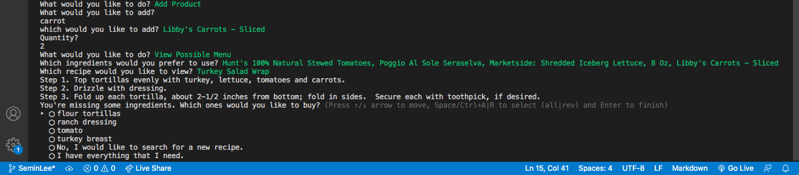
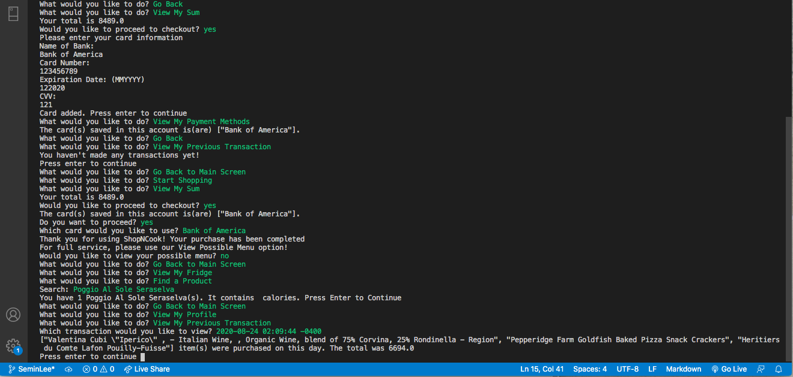

# 🍚 🍚 🍚  SHOP N COOK 🍚 🍚 🍚 
Shop N Cook will help your cook time easier, faster, and more enjoyable!!!
- With Shop N Cook, you can shop for ingredients, look through recipe for possible food selection while you wait.
- OR, you can choose a recipe first, and find ingredients you need and shop.

## This project includes...
Spoonacular API
- Retrieve ingredients: title, price, calories
- Retrieve recipes: title, ingredients, steps

## User should be able to...
- Create an account, including login and personal information
- Edit account information
- View, add, and remove ingredients in their fridge
- Search database for ingredients by name and purchase ingredients
- Add purchased ingredients to fridge
- Search database for recipes based on owned ingredients
- Reivew past purchased

## To run this CLI...
1. Clone this repository
2. ```bundle install```
3. Run ```ruby tools/console.rb``` in your terminal.
4. Create a new account and explore!

## Into the app 🚀 
Let's create a new account, and fill the fridge! Go to "View My Fridge" and start searching the items you have in your house. If there is no option for your item, please choose the closest one. There is also delete/find a product option, so delete a product if you used the ingredient for a recipe. (Stretch goal #1: delete the product with correct quantity if it was used in a recipe)


Once you finished adding items into the fridge, you can start "View Possible Menu" and choose items that you want to use. 



The app will provide selections of menu. Once chosen, you will see instructions of recipe, abd a list of missing ingredients, if any. You can choose to shop for those, or continue with your ingredients.

Let's take a look at carts. If you go to "Start Shopping," you can add items into the cart like you did with the fridge. But now, you will see prices and calories of each item. It is generated by Spoonacular API, which used avergae price for prices. (Stretch goal #2: We noticed that Spoonacular API was inconsistent with price and calories, so we will need to find another supermarket API.) 

You can view your cart at "View My Cart," where you can see the selections of chosen items, and remove any unwanted item. You can proceed to checkout at "View My Sum." If you are first time using this app, you'll have to provide your credit card information. Upon saving the information, you will have to go back to checkout to proceed to checkout. You will see that bank information will appear noww. 
After checkout, you can see that...
- items have been added to the fridge. 
- items have been removed from the cart.
- latest transaction history was updated.



Enjoy rest of your experience with Shop N Cook!

## Developers
### Se Min Lee
- email: seminlee2794@gmail.com
- github: https://github.com/Seminlee94
- linkedIn: https://www.linkedin.com/in/se-min-lee-149188105/
- Medium: https://medium.com/@mlsml94
- portfolio: https://seminlee94.github.io/semin/   <--- coming soon!

### Jacob Lozano

# Demo
- https://www.youtube.com/watch?v=TVFmlVFrffw&t=5s  << Shop N Cook
- https://www.youtube.com/watch?v=sn4SqkDkPZQ&t=62s  << Q & A website using Ruby on Rails (Check out my 2nd project as well!)
- https://github.com/cdemarti/mod2_final_project    << code for my 2nd project
